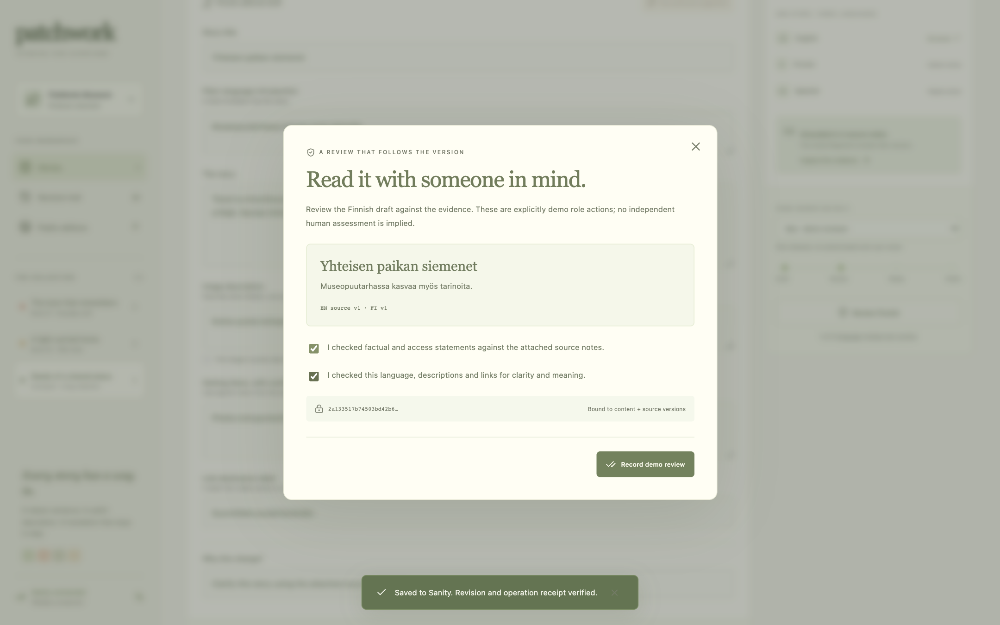
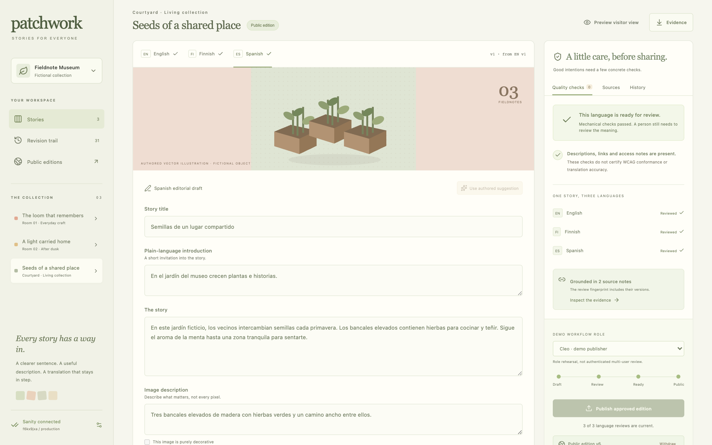
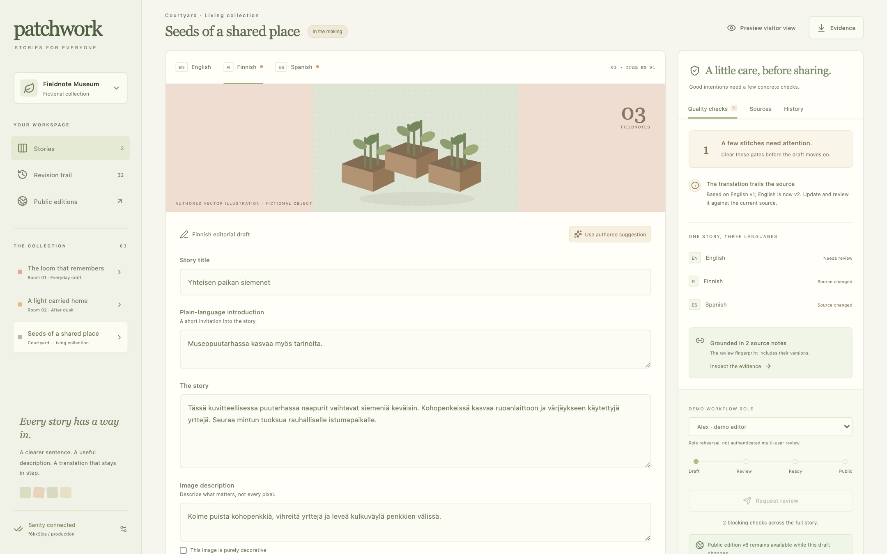
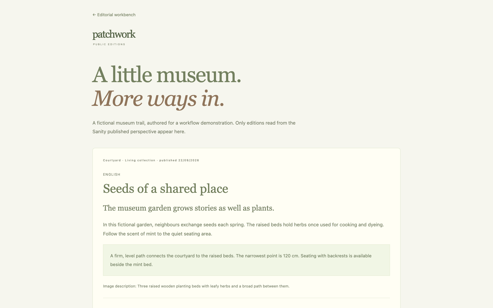

# Patchwork

**Every visitor belongs in the story.** An editorial workbench for accessible, multilingual museum content, backed by Sanity revisions and inspectable source evidence.

A museum corrects an entrance description. The English draft changes, but its translated access instructions are still old. Patchwork makes that dependency visible: translations carry the source revision they used, and reviews are bound to exact content and evidence versions. A stale approval cannot publish a new edition.

Original September 2026 project for **DEV Sanity Challenge, Path Two**. Substantial AI assistance is disclosed; the app performs no model inference. All museum stories, translations and access measurements are authored synthetic fixtures, not real venue records or professional accessibility assessments.

## Live Sanity project

Project **`f6kx9jxa`**, public dataset **`production`**. Two published trilingual editions, readable without a token:

<https://f6kx9jxa.api.sanity.io/v2026-09-21/data/query/production?query=*%5B_type%20%3D%3D%20%22patchworkPublication%22%5D>

The full live acceptance checklist passed against this project on September 22 PDT, 2026 ([evidence](docs/VALIDATION.md)). Drafts, sources and revision receipts stay under `drafts.` and are not publicly readable.

| Review bound to exact versions                                     | Published, all reviews current                                     |
| ------------------------------------------------------------------ | ------------------------------------------------------------------ |
|  |  |
| **English edited: translations stale**                             | **Visitor page, published perspective**                            |
|        |               |

A 2-minute narrated film of the real app and project is described in [DEMO.md](docs/DEMO.md).

## Run the local rehearsal

Node 22.12+ required. Tested with Node 26.7.

```sh
npm ci
npm run dev
```

Open **http://127.0.0.1:4327/**. Without Sanity configuration, the interface explicitly says **local rehearsal**. Editing, source corrections, reviews and history work locally. **Cloud publication is disabled.** The `/visit` route displays no editions unless it can read actual published documents from Sanity.

Rehearsal state persists in this browser's local storage. Use “Restore local fixture” to reset that local workspace. Connected Sanity data is never reset by that button.

## Connect actual Sanity

To run against your own project (the token for `f6kx9jxa` is not distributed):

1. Create a dedicated **public dataset** for these non-sensitive synthetic fixtures.
2. Copy `.env.example` to `.env.local`; set `SANITY_PROJECT_ID`, `SANITY_DATASET`, and a **server-only** write token in `SANITY_API_TOKEN`. Never use a `NEXT_PUBLIC_` variable for the token.
3. Restart `npm run dev`. “Check connection” performs a real query. Then explicitly click “Seed synthetic drafts,” or run:

```sh
npm run seed -- --confirm-public-fixtures
```

Seeding atomically creates the three entries, six source notes and workspace manifest as draft documents. It refuses to overwrite an existing manifest. It creates **zero public editions**. It does not silently upload your local rehearsal changes.

4. Complete the workflow, publish, then inspect `/visit` and the actual Sanity documents. A successful write is shown only after the operation receipt is read back. Full setup and verification: [SANITY.md](docs/SANITY.md).

No inference key is used. The Sanity token never reaches browser code, public environment variables, logs or exports. The authoring server binds to localhost. Remote deployment is read-only; this prototype is not a production authentication system.

## A complete workflow

1. Open the loom. English has four visible quality gates: summary, alternative text, access note and descriptive link label.
2. Load the **authored fixture suggestion**, inspect its evidence, then save. This is supplied editorial copy, not a live AI completion.
3. Finnish and Spanish become stale because English changed. Edit each, or if it is still correct, use “Confirm against EN vN” to save it against the current English revision. The app does not pretend a machine presence check validates translation meaning.
4. Request review. Switch to the clearly labeled **demo reviewer role**, inspect each language and its source notes, and explicitly record both confirmations. These are role demonstrations, not claimed independent human reviews.
5. All three fresh reviews make the draft ready. The publisher role can publish only when an actual Sanity connection is configured and the checks still pass.
6. The published edition is a separate immutable content snapshot. Later draft edits leave it intact. Source corrections invalidate reviews. History restore creates a new unapproved draft. Withdrawal explicitly removes the public edition while preserving draft/history evidence.

## Why Sanity matters here

This is an editing workflow, not a read-only CMS skin. Its document model separates:

| Document type          | Stored role                                                                |
| ---------------------- | -------------------------------------------------------------------------- |
| `patchworkEntry`       | Draft stage, localized revisions, English lineage and source ids           |
| `patchworkSource`      | Versioned curatorial/access evidence                                       |
| `patchworkRevision`    | Exact command identity/hash, actor role, reason and before/after snapshots |
| `patchworkManifest`    | Document inventory and optimistic concurrency boundary                     |
| `patchworkPublication` | The approved multilingual edition read by visitors                         |

Draft, source, revision and manifest document IDs begin with `drafts.`. Public editions use a distinct non-draft type and ID. The server uses the authenticated `raw` perspective for authoring and the `published` perspective for visitors. The complete Sanity Studio schema is in `studio/schemaTypes`; it is intentionally read-only so Studio edits cannot accidentally bypass workflow validation. API tokens with write permission remain powerful; Studio read-only settings are not an access-control boundary.

Mutations use `@sanity/client`, one transaction, and exact `ifRevisionID` preconditions on the manifest, every entry and every source, changed or not. Newly created operation receipts and editions use `create`, not overwrite; unchanged editions and receipts are not rewritten, so a public edition's `_rev` only moves when it is republished. A stale source or concurrent workflow write returns a conflict. A lost transaction response triggers a receipt read before any retry; identical operation ids are idempotent only when the entire command matches.

## Test

```sh
npm test
npm run check
npm run build
```

Tests cover translation lineage, fresh approvals, source invalidation, immutable published snapshots, restoration, role guards, stale-version conflicts, idempotency, full document mapping, atomic transaction preconditions, lost-success reconciliation and seed non-overwrite. Cloud adapter tests use an explicitly labeled transaction test double. The live run against `f6kx9jxa`, its operation ids and `_rev` readbacks, and the two bugs it found are recorded separately in [VALIDATION.md](docs/VALIDATION.md).

## Limits and honesty

- Presence checks, link-label heuristics and sentence-length prompts are not WCAG certification, translation evaluation or proof of accessibility.
- The demo role picker is not account authentication, independent review or a production authorization design. Authoring is local; do not expose the write endpoint as a public editing service.
- Public dataset selection is intentional for the challenge's non-sensitive fixture. Draft exports include the entire rehearsal audit. Do not enter private source material.
- The current visitor trail has three fictional stories, three languages and original vector illustrations. Link labels are edited and checked, but the draft preview does not pretend a destination was configured.
- Polling/refresh reads the current cloud snapshot. No live-listener integration or authenticated multi-user presence is claimed.
- A revision-based publish is verified application behavior; it does not establish real-world museum impact.

MIT license. Original implementation, fixtures, schema and artwork developed with substantial OpenAI Codex assistance; Claude assisted with the live acceptance run, its fixes, the film and the write-up. No source/data copied from YC Palinode, Counterseed or other campaign repositories. Dependencies retain their licenses. [Build process](docs/BUILD-PROCESS.md) · [demo script](docs/DEMO.md) · [challenge requirements](docs/CHALLENGE.md).
